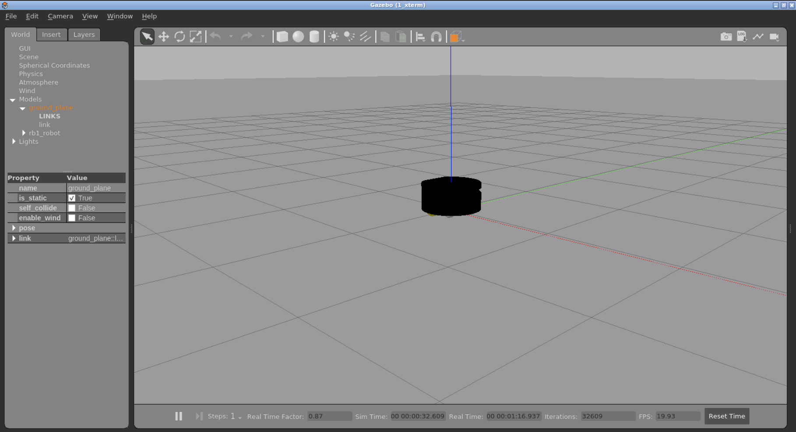

# Checkpoint 8

<a name="readme-top"></a>

## About The Project
Package for simulating a differential type robot including ROS2 differential controller and an effort controller for the platform.
Two approach are used as a Gazebo plugin or as ROS controller.



<!-- GETTING STARTED -->
## Getting Started

### Software Prerequisites
* ROS2 Humble

<p align="right">(<a href="#readme-top">back to top</a>)</p>

<!-- INSTALLATION -->
### Installation
1. Clone the repo
   ```sh
   cd ~ && \
   git clone https://github.com/pvela2017/The-Construct-CheckPoint-8-ROS2-Control
   ```
2. Compile
   ```sh
   source /opt/ros/humble/setup.bash && \
   cd ~/The-Construct-CheckPoint-8-ROS2-Control/ros2_ws_plugin_type && \
   colcon build && \
   cd ~/The-Construct-CheckPoint-8-ROS2-Control/ros2_ws_ros_controller_type && \
   colcon build
   ```

<p align="right">(<a href="#readme-top">back to top</a>)</p>


<!-- USAGE of the ROBOT -->
## Usage Robot ROS Controller type
1. Launch the simulation and activate the controllers:
```sh
source /opt/ros/humble/setup.bash && \
source ~/The-Construct-CheckPoint-8-ROS2-Control/ros2_ws_ros_controller_type/install/setup.bash && \
ros2 launch rb1_ros2_description rb1_ros2_xacro.launch.py
```
2. Move the robot:
```sh
source /opt/ros/humble/setup.bash && \
source ~/The-Construct-CheckPoint-8-ROS2-Control/ros2_ws_ros_controller_type/install/setup.bash && \
ros2 topic pub --rate 10 /rb1_base_controller/cmd_vel_unstamped geometry_msgs/msg/Twist "{linear: {x: 0.0, y: 0, z: 0.0}, angular: {x: 0.0,y: 0.0, z: 0.2}}"
```
3. Lift the platform:
```sh
source /opt/ros/humble/setup.bash && \
source ~/The-Construct-CheckPoint-8-ROS2-Control/ros2_ws_ros_controller_type/install/setup.bash && \
ros2 topic pub --rate 10 /elevator_controller/commands std_msgs/msg/Float64MultiArray  "data:
- 10.0"
```
4. Lower the platform:
```sh
source /opt/ros/humble/setup.bash && \
source ~/The-Construct-CheckPoint-8-ROS2-Control/ros2_ws_ros_controller_type/install/setup.bash && \
ros2 topic pub --rate 10 /elevator_controller/commands std_msgs/msg/Float64MultiArray  "data:
- -10.0"
```
5. Check controllers and hardware interfaces:
```sh
ros2 control list_hardware_interfaces
ros2 control list_controllers
```

<!-- KEYS -->
## Key topics learnt
* ROS2 Controller.
* Gazebo Plugin.